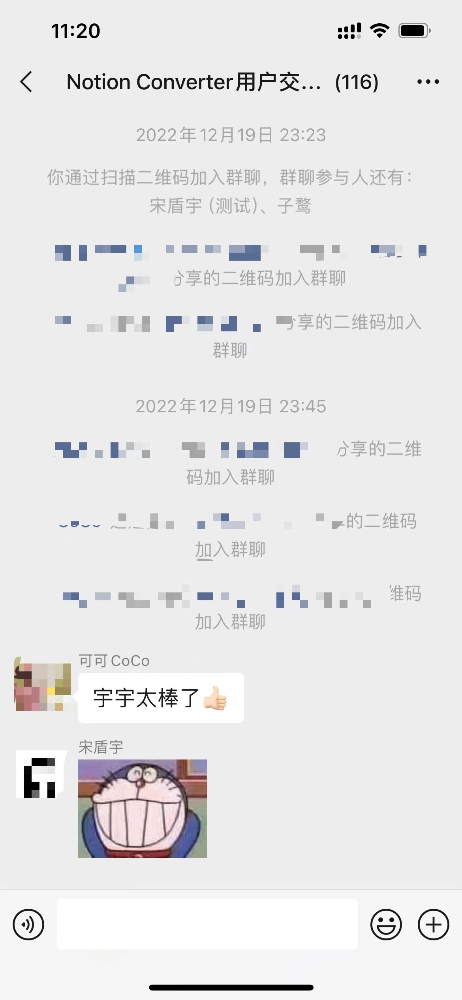

# Notion Converter一周年

时间飞快，[Notion Converter插件](https://chromewebstore.google.com/detail/notion-converter%EF%BC%9A%E5%85%AC%E4%BC%97%E5%8F%B7%E4%B8%80%E9%94%AE%E6%8E%92%E7%89%88%E5%A4%8D/jmhmlnooegbmldeinblplmmmgbhlomnp)从距离写下第一行代码到现在，正好过了一周年，今天就在一周年纪念日写一篇文章回顾一下吧。
<!--more-->

第一行代码

时间拨回到2022年12月4日，我的好友盾宇找到我，说想让我帮忙一起开发一个浏览器插件，可以一键方便地把Notion文章以微信公众号的排版复制到公众号编辑器里发布，因为她是个Notion重度用户，同时又有一个频繁更新的公众号，这个需求对她来说很重要。正好那时候我也想尝试做一些前端相关的项目，于是一拍即合便开工了。

第一版的开发还是蛮痛苦的，踩了很多坑，因为不知道微信编辑器是如何识别剪切板的内容，判断是文本还是HTML代码。搜索并参考了很多资料才把这个最核心的点调试成功。其次我们希望这个插件要做到上手即用，于是决定不接入Notion API解析，而是直接解析Notion的DOM结构，再用jQuery生成公众号编辑器里的DOM结构。这个流程让我有一种回到10年前写前端的感觉。

在开发了几周后，第一个版本如约上线，盾宇邀请了第一批用户（小白鼠lol）使用我们的插件。

很感谢第一批用户愿意使用我们的插件，毕竟第一版的UI设计和交互做的实在是太丑了，站在一年后的今天再回头看，简直不忍直视。

错乱的UI

第一版

插件上两个意义不明的图标，加上最初只支持最基础的几个格式解析，不支持Notion的嵌套块和一些比较独有的块，于是经常用户点开插件会发现插件白屏，或者某些文本没有解析到。所以那段时间我们一直在迭代，UI的更新，支持更多格式，以及那段时间发布的一个最重要的功能：提供更多主题。

经过优化后的UI虽然已经比第一版好看很多，但还是不能算精致，于是我们请了自己的设计师对UI进行一个大改版，这便是Notion Converter2.0。

设计师的精彩设计，搭配活泼的颜色和自然的布局，让插件瞬间充满了活力，经过这次的改版设计，我们可以自豪的说，目前插件的颜值已经是同类产品的佼佼者了。

得益于我们不断的迭代和优化（截止到今天总共提交262次，代码修改上万行，拿出去开源都能领JetBrains的免费License）

以及对用户问题的快速响应（有一个用户就是因为我们对他问题的快速响应和修复，决定付费年费会员），插件用户数也在不断上升，截止目前用户已经有1000+，在谷歌商店也收获了9个好评。与此同时我们不会停下更新的脚步，会一直伴随大家创作精彩的文章。

